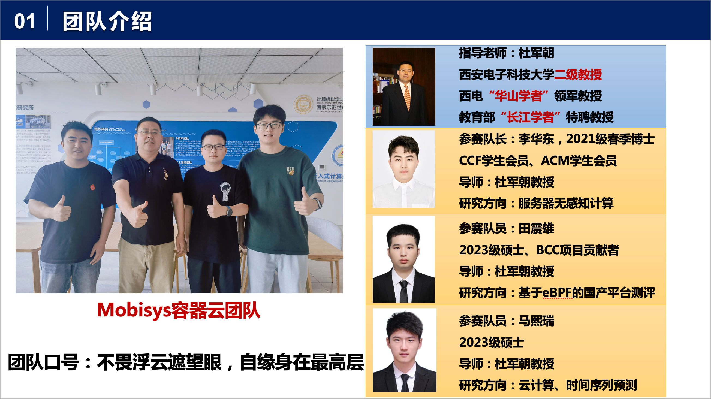

# 西电mobisys容器云团队——基于eBPF的容器异常行为检测系统

## 0. 团队介绍

## 1. 项目简介

### 1.1. 赛题说明

1）近年来，由于容器的可扩展、轻量级等优点，基于容器的虚拟化（如Docker [1]）在云计算中越来越受欢迎。与传统的基于虚拟机监视器（VMM）的虚拟化不同，基于容器的虚拟化技术共享相同的底层主机操作系统(OS)，而没有VMM和Guest OS。这种差异有助于容器消除大部分虚拟机(VM)所遭受的开销。最近的研究[2,3]表明，在各种工作负载下，容器在CPU、内存和输入/输出方面实现了接近原生性能。虽然容器的轻量级隔离机制带来了开销优势，但是隔离不足也会导致容器异常。因此容器异常事件频发，例如性能不稳定[4,5]、系统崩溃[6,7]和安全问题[8,9]。 

2）eBPF（extended Berkeley Packet Filter）是一种内核技术，它允许开发人员在不修改内核代码的情况下运行特定的功能。eBPF 的概念源自于 Berkeley Packet Filter（BPF），后者最初是由贝尔实验室开发的一种捕获和过滤网络数据包的过滤器。eBPF经过不断的发展和功能完善已经被广泛应用于网络监控[10]、安全过滤[11]、性能分析[12]等多种场景中。eBPF的强大能力也为容器异常检测提供了更多的机会。 

3）本题目旨在通过ebpf实现容器异常检测框架。该框架通过ebpf收集容器的行为特征（例如系统调用频率、系统调用序列、文件访问、网络通信等活动）、指标特征（例如IO吞吐、内存利用率、CPU利用率等）等数据，采用人工智能算法自动识别具有异常行为的容器。检测的容器异常行为包括：可疑的系统调用、未经授权的容器互访、容器内异常进程的创建、异常的资源使用量等。

### 1.2. 赛题要求

1）可扩展的ebpf数据采集框架。该框架需要使用ebpf采集各种有助于判断异常容器行为的数据。常见的数据包括：系统调用类型、资源使用量、流量特征等等。该框架需要具有扩展能力，用户可以快速方便地添加新的数据采集类型。 

2）采集框架具有可忽略的性能开销。CPU占用控制在10%以内，保证被监控容器的正常流畅运行。

3）准确的检测算法。利用机器学习、深度学习等技术实现容器异常行为的自动检测。该检测算法需要具有高准确率，选择合适的指标作为输入，检测各种不同类型的异常行为。 

4）清晰的数据、检测过程展示界面。借助grafana等UI系统，实现各种数据的汇总展示以及异常容器检测时的分析流程展示。

### 1.3. 赛题导师

[chengshuyi.csy@alibaba-inc.com](mailto:chengshuyi.csy@alibaba-inc.com)

### 1.4. 参考资料

Docker, 2024, https://www.docker.com/. (Accessed March 7, 2024).

P. Sharma, L. Chaufournier, P. Shenoy, Y. Tay, Containers and virtual machines at scale: A comparative study, in: Proceedings of International Middleware Conference, Middleware, 2016, pp. 1–13.

M. Plauth, L. Feinbube, A. Polze, A performance survey of lightweight virtualization techniques, in: Proceedings of European Conference on Service-Oriented and Cloud Computing, ESOCC, 2017, pp. 34–48.

Y. Li, J. Zhang, C. Jiang, J. Wan, Z. Ren, PINE: Optimizing performance isolation in container environments, IEEE Access 7 (2019) 30410–30422. 

J. Khalid, E. Rozner, W. Felter, C. Xu, K. Rajamani, A. Ferreira, A. Akella, Iron: Isolating network-based CPU in container environments, in: Proceedings of USENIX Symposium on Networked Systems Design and Implementation, NSDI, 2018, pp. 313–328.

S. Soltesz, H. Pötzl, M.E. Fiuczynski, A. Bavier, L. Peterson, Container-based operating system virtualization: A scalable, high-performance alternative to hypervisors, in: Proceedings of European Conference on Computer Systems, EuroSys, 2007, pp. 275–287. 

O. Laadan, J. Nieh, Operating system virtualization: Practice and experience, in: Proceedings of Annual Haifa Experimental Systems Conference, SYSTOR, 2010, pp. 1–12.

X. Gao, Z. Gu, M. Kayaalp, D. Pendarakis, H. Wang, ContainerLeaks: Emerging security threats of information leakages in container clouds, in: Proceedings of International Conference on Dependable Systems and Networks, DSN, 2017, pp. 237–248. 

X. Gao, Z. Gu, Z. Li, H. Jamjoom, C. Wang, Houdini’s escape: Breaking the resource rein of Linux control groups, in: Proceedings of ACM SIGSAC Conference on Computer and Communications Security, CCS, 2019, pp. 1073–1086.

Cilium, https://cilium.io/. (Accessed March 7, 2024).

Falco, [https://falco.org/.](https://falco.org/) (Accessed March 7, 2024).

BCC, https://github.com/iovisor/bcc. (Accessed March 7, 2024).

## 2. 项目结构

### 2.1 [ebpf数据采集模块](./ebpf数据采集模块/)
运行在龙蜥操作系统上，负责采集容器运行时的信息，将采集到的信息发送到kafka消息队列中。

### 2.2 [aigorithm算法处理模块](./aigorithm算法处理模块/)
运行在任意Linux服务器上，负责从kafka消息队列中获取数据，进行异常检测算法处理。

### 2.3 [docs项目文档](./docs项目文档/)
项目文档，包括项目设计文档、PPT、演示视频等。